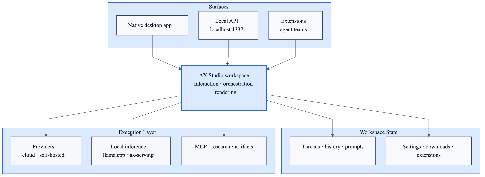
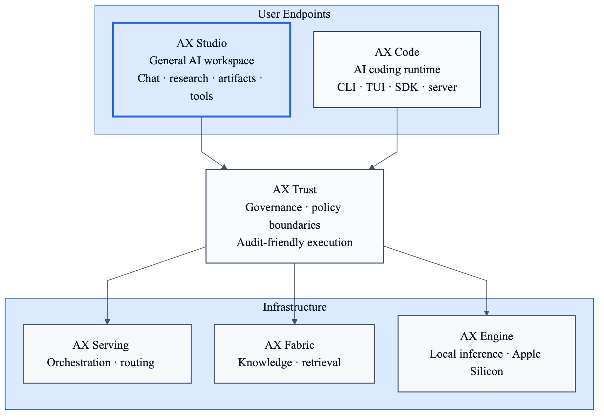

# AX Studio

**AI workspace for teams that need one controlled desktop surface across cloud models, local inference, tools, artifacts, and research workflows.**

AX Studio is a native desktop execution environment for general-purpose AI work. It combines provider abstraction, local inference, MCP integrations, artifacts rendering, agent teams, research workflows, and persistent conversation state into one cross-platform app that runs on macOS, Windows, and Linux.

- **Unified workspace** across cloud providers, self-hosted backends, and OpenAI-compatible endpoints
- **Local-first desktop app** with direct provider connections and on-device inference options
- **Rich execution surface** for artifacts, research, diagrams, code execution, and tool-enabled workflows
- **Extensible platform** through MCP, bundled extensions, agent teams, and a local API
- **Cross-platform native delivery** with Tauri, React, and a Rust backend

Built by [DEFAI Digital](https://github.com/defai-digital).

[](https://github.com/defai-digital/ax-studio/releases)
[](https://discord.gg/cTavsMgu)
[](LICENSE)

## Why AI Workspaces Break Down

AI work often fragments across too many tools: one app for cloud chat, another for local models, another for research, another for diagram rendering, and another for tool integrations.

- **Provider fragmentation** makes teams switch between UIs instead of workflows
- **Local inference fragmentation** separates self-hosted models from the main workspace
- **Output fragmentation** makes research, artifacts, and code execution feel bolted on rather than native

AX Studio addresses that with a single desktop workspace that unifies providers, local inference, MCP tools, artifacts, research, and persistent threads.

## What AX Studio Is

Most AI desktop apps stop at chat plus provider settings. AX Studio is designed as a workspace layer for AI operations. It is more than a desktop chat app: it is a native AI workspace for model interaction, tool use, rendering, and orchestration.

- **More unified than provider-specific desktop apps.** One workspace can connect cloud models, local inference, and self-hosted endpoints.
- **More capable than a thin chat wrapper.** Artifacts, MCP, agent teams, research, and rendering are part of the product surface.
- **More deployable than cloud-only AI clients.** Teams can run against hosted providers, local models, or sovereign infrastructure.
- **More extensible than fixed consumer chat apps.** Extensions, local APIs, and MCP integrations make it usable as an internal platform surface.

## Why Teams Choose AX Studio

Teams adopt `ax-studio` when they need AI work to happen inside one workspace they can extend, connect, and operate, rather than across disconnected chat clients and local model tools.

| Requirement | Typical AI desktop tooling | AX Studio |
|-----------|-----------------------------|-----------|
| Use multiple cloud and self-hosted models in one place | Often tied to one provider or one API style | Unified workspace across major providers and OpenAI-compatible endpoints |
| Bring local inference into the same product surface | Usually split into separate local-model apps | Built-in local inference paths through llama.cpp and ax-serving |
| Connect tools, APIs, and data sources | Integrations are limited or UI-specific | Built-in MCP client plus extension system |
| Render rich outputs inside the workspace | Often limited to markdown or plain chat output | Artifacts engine for HTML, React, SVG, Chart.js, Vega-Lite, and Mermaid |
| Operationalize team workflows | Chat is usually isolated from reusable execution flows | Persistent threads, agent teams, execution logs, and local API surface |

## Primary Users

### Primary

- **AI-native product and operations teams** that need one workspace across providers, research, and artifacts
- **Advanced users and researchers** who switch frequently between hosted and local models
- **Developer and infrastructure teams** building local-AI or MCP-enabled workflows into their daily work

### Secondary

- **General knowledge workers** who want a stronger local and multi-provider alternative to provider-specific chat apps

---

## Workspace Architecture

This is the product workspace itself, independent of the broader ecosystem:

<p align="center">
  
</p>

Source: [docs/ax-studio-runtime.mmd](docs/ax-studio-runtime.mmd)

The important distinction is that `ax-studio` is not just a model picker inside a desktop shell. It is a workspace that coordinates:

- native desktop surfaces, local APIs, and extension entry points
- thread state, prompts, downloads, and workspace settings
- provider routing across cloud, self-hosted, and local inference backends
- MCP tools, research flows, artifacts rendering, and interactive outputs
- agent teams and reusable execution flows inside the same app

## High-Value Use Cases

1. **Unified AI workspace** for teams that use multiple providers and local models every day
2. **Research and analysis workflows** with web search, artifacts, and persistent threads
3. **Local model workstations** that need llama.cpp or ax-serving without leaving the main app
4. **Internal tool hubs** where MCP servers, databases, APIs, and agent teams live in one desktop surface

## When To Use AX Studio

- You need one app for cloud models, self-hosted backends, and local inference
- You want MCP tools, research, rendering, and chat to live in the same workspace
- You need a desktop surface that can also expose a local API and extension hooks
- You want AI workflows that remain local-first while still supporting hosted providers when needed

## The AutomatosX Ecosystem

AX Studio is the general-purpose workspace layer inside the broader AutomatosX platform:

<p align="center">
  
</p>

Source: [docs/automatosx-studio-stack.mmd](docs/automatosx-studio-stack.mmd)

Within AutomatosX, `ax-studio` is the general AI workspace. `AX Code` focuses on coding execution, `AX Engine` handles inference, `AX Serving` handles orchestration, `AX Fabric` handles knowledge, and `AX Trust` provides governance and policy boundaries.

| Component | Repository | Role |
|-----------|-----------|------|
| **AX Studio** | [defai-digital/ax-studio](https://github.com/defai-digital/ax-studio) | General AI workspace for chat, tools, local inference, research, and artifacts |
| **AX Code** | [defai-digital/ax-code](https://github.com/defai-digital/ax-code) | AI coding runtime and developer-focused execution surface |
| **AX Trust** | — | Governance and policy boundaries for controlled execution |
| **AX Serving** | [defai-digital/ax-serving](https://github.com/defai-digital/ax-serving) | Orchestration, routing, and serving for production inference |
| **AX Fabric** | [defai-digital/ax-fabric](https://github.com/defai-digital/ax-fabric) | Knowledge infrastructure, retrieval, and knowledge lifecycle |
| **AX Engine** | [defai-digital/ax-engine](https://github.com/defai-digital/ax-engine) | Local and sovereign inference optimized for Apple Silicon |

---

## Get Started in 60 Seconds

### Prerequisites

- Node.js 20+
- Yarn 4.5.3+
- Rust 1.77.2+
- Tauri CLI 2.7.0+

```bash
cargo install tauri-cli
git clone https://github.com/defai-digital/ax-studio
cd ax-studio
make dev
```

`make dev` installs dependencies, builds the core package and bundled extensions, downloads required binaries, and launches the desktop app with hot reload.

### Connect a Provider

On first launch, go to **Settings → AI Providers** and add an API key for any supported provider, or point the app at a self-hosted backend.

---

## Supported Providers

### Cloud

| Provider | Type |
|----------|------|
| **OpenAI** | Cloud |
| **Anthropic** | Cloud |
| **Azure OpenAI** | Cloud |
| **Mistral** | Cloud |
| **Groq** | Cloud |
| **Google Gemini** | Cloud |
| **OpenRouter** | Aggregator |
| **HuggingFace** | Cloud + Hub |

### Self-Hosted and Local

| Provider | Type |
|----------|------|
| **ax-serving** | Self-hosted |
| **llama.cpp** | Local inference |
| **Any OpenAI-compatible endpoint** | Self-hosted |

---

## Core Features

### Unified AI Workspace

AX Studio gives one desktop surface for:

- provider-backed chat
- persistent threads and split-screen conversation flows
- per-thread prompts and workspace settings
- rich outputs and rendered artifacts

### Local Inference

AX Studio supports local inference through two main paths:

- **llama.cpp extension** for local GGUF model loading and local process management
- **ax-serving** for production-style local inference with routing, health-aware behavior, and external orchestration

### MCP and External Tooling

AX Studio has a built-in MCP client. Add servers in **Settings → MCP Servers** and connect tools, APIs, and databases through:

- **stdio**
- **HTTP SSE**

### Artifacts and Rich Output

AX Studio can render outputs directly inside the workspace, including:

- HTML
- React
- SVG
- Chart.js
- Vega-Lite
- Mermaid

### Agent Teams and Research

The workspace also supports:

- multi-agent team workflows
- deep research with web search
- execution logs
- semantic memory search
- voice features including STT and TTS

### Local API and Extensions

AX Studio exposes a local OpenAI-compatible API on `localhost:1337` and supports a TypeScript extension system for deeper product customization.

---

## Local Control and Security Posture

- Cloud provider calls go directly from your device
- Local inference can run fully on your machine
- Python code execution runs in a Docker sandbox
- Desktop delivery uses a native Tauri host instead of a browser-only shell

This makes AX Studio suitable for teams that want a stronger local control model than provider-hosted chat products.

---

## Build from Source

### Common Targets

| Target | Description |
|--------|-------------|
| `make dev` | Install deps and launch the desktop app with hot reload |
| `make build` | Production build for the current platform |
| `make test` | Run linting, frontend tests, and Rust tests |
| `make clean` | Delete build artifacts and caches |
| `make dev-web-app` | Frontend-only development server |
| `make dev-android` | Android development build |
| `make dev-ios` | iOS development build on macOS |

### Manual Flow

```bash
yarn install
yarn build:tauri:plugin:api
yarn build:core
yarn build:extensions
yarn dev:tauri
```

### Platform Builds

```bash
yarn build:tauri:darwin
yarn build:tauri:win32
yarn build:tauri:linux
```

---

## Installation

Download the latest release from [GitHub Releases](https://github.com/defai-digital/ax-studio/releases).

| Platform | Format |
|----------|--------|
| **macOS (Universal)** | `.dmg` |
| **Windows** | `.exe` installer |
| **Linux (Debian/Ubuntu)** | `.deb` |
| **Linux (Portable)** | `.AppImage` |

---

## Repository Layout

```text
ax-studio/
├── web-app/               # React frontend and workspace UI
├── src-tauri/             # Rust backend, IPC, storage, MCP, downloads, updater
├── core/                  # @ax-studio/core extension interfaces and shared types
├── extensions/            # Bundled extensions including assistant, conversation, llama.cpp
├── packages/              # Supporting packages
├── scripts/               # Build, release, and testing scripts
└── docs/                  # Product, implementation, and architecture documents
```

---

## Tech Stack

**Frontend:** React 19, TypeScript, Vite, TanStack Router, Zustand, Vercel AI SDK, Tailwind CSS, Vitest

**Backend:** Tauri 2.8, Rust, Tokio, rmcp, Hyper, Reqwest, Serde

**Platform:** macOS, Windows, Linux, plus mobile development targets via Tauri

---

## Contributing

At this time, AX Studio is **not accepting unsolicited public code contributions or pull requests**.

What we do welcome:

- bug reports
- feature requests and wishlist items
- product feedback
- reproducible issue reports with logs, screenshots, or environment details

See [CONTRIBUTING.md](CONTRIBUTING.md) for the current repository policy and the best way to submit feedback.

## Community

Join us on [Discord](https://discord.gg/cTavsMgu).

## Project History

AX Studio was originally derived from [Jan](https://github.com/janhq/jan), licensed under the Apache License 2.0. It has since been substantially reworked and is now independently maintained and operated by DEFAI Private Limited as a decoupled product within the broader AutomatosX ecosystem.

## License

[Apache 2.0](LICENSE). See [NOTICE](NOTICE) for project provenance and attribution.
