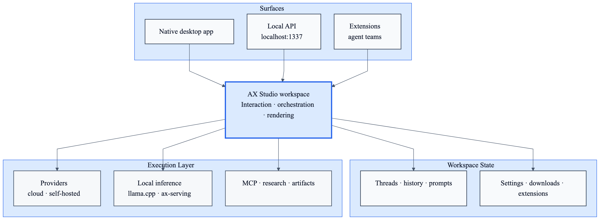

# AX Studio

**A local-first AI workspace for people and teams who need chat, models,
tools, memory, knowledge, and local execution in one controlled desktop app.**

AX Studio is a native [Electron](https://www.electronjs.org/) desktop
application with a Node.js main process and React frontend. It brings cloud
providers, OpenAI-compatible endpoints, bundled local inference, Apple MLX
through AX Engine, persistent memory, artifacts, and a local API server into
one workspace.

- **Start quickly** with the desktop app, connect a provider, and chat in
  minutes
- **Run local-first** with on-device threads, settings, memory, downloads, and
  optional local inference
- **Choose the right model** across OpenAI, Anthropic, Azure OpenAI,
  OpenRouter, xAI, Groq, Gemini, MLX, `llama.cpp`, Ollama, and custom
  OpenAI-compatible endpoints
- **Connect tools safely** through MCP servers, local files, downloads, and
  provider/runtime logs
- **Operate like a workspace** with projects, persistent threads, Smart Start,
  research reports, artifacts, local knowledge, and a localhost API

Built by [DEFAI Digital](https://github.com/defai-digital).

[](https://github.com/defai-digital/ax-studio/releases)
[](https://github.com/defai-digital/ax-studio/releases)
[](https://github.com/defai-digital/ax-studio/releases)
[](https://github.com/defai-digital/ax-studio/releases)
[](https://discord.gg/pFc3z3uf4M)
[](LICENSE)

---

## Get Started

### Installation Index

- [macOS Apple Silicon](#macos-apple-silicon---recommended) — Homebrew or GitHub release
- [Windows x64 and ARM64](#windows) — signed installer from GitHub Releases
- [iPad](#ipad-apiurl-first-planned) — planned App Store/TestFlight client using an API or base URL

### Supported Desktop Targets

| Platform | Status | Install path |
| --- | --- | --- |
| macOS Apple Silicon | Active support | Homebrew cask or GitHub release assets |
| Windows x64 | Active support | Signed GitHub NSIS installer (winget planned) |
| Windows ARM64 | API/URL client | Signed GitHub NSIS installer (winget planned) |
| Linux desktop | Not active support | Source builds only, without release/SLA expectations |

### System requirements

| Platform | Requirements |
| --- | --- |
| macOS | **15.0 (Sequoia) or later**, **Apple Silicon** only |
| Windows x64 | Windows 10/11; WebView2 (bootstrapper included in setup) |
| Windows ARM64 | Windows 11 ARM; WebView2; local inference is API/URL-first |

Linux users should use AX Serving, OpenAI-compatible endpoints, or source builds
when they need AX workflows outside the supported desktop release targets.

### Platform and Inference Profiles

AX Studio uses different local-inference profiles by platform:

| Profile | Platforms | Inference model |
| --- | --- | --- |
| Primary desktop client | macOS Apple Silicon | AX Engine/MLX and `llama.cpp` |
| CUDA desktop client | Windows x64 | `llama.cpp`; CUDA is selected when a compatible NVIDIA GPU and driver are available |
| API/URL-first client | Windows ARM64 and iPad | Connect to a local or remote OpenAI-compatible inference endpoint such as AX Serving, Ollama, or another reachable server |

Windows ARM64 does not run a local inference backend in the supported product
configuration. It is an API/URL client, as is iPad; neither target downloads or
executes AX Engine or `llama.cpp` binaries.

### Install

#### macOS Apple Silicon - recommended

1. Install Homebrew if you do not already have it:

```bash
/bin/bash -c "$(curl -fsSL https://raw.githubusercontent.com/Homebrew/install/HEAD/install.sh)"
```

2. Install and launch AX Studio:

```bash
brew install --cask defai-digital/tap/ax-studio
open -a "AX Studio"
```

Already have Homebrew? Start from step 2. The fully qualified command adds the
shared DefAI Digital tap automatically.

The Homebrew cask is the fastest install path for supported Macs. Manual
downloads are available from GitHub Releases if you prefer not to use Homebrew.

#### Windows

Download AX Studio only from the official
[GitHub Releases](https://github.com/defai-digital/ax-studio/releases/latest)
page:

- Windows on Intel or AMD: use `AX.Studio_*_x64-setup.exe`.
- Windows on ARM: use `AX.Studio_*_arm64-setup.exe`.
- The **NSIS setup installer** is the only supported public install path
  (per-machine). Portable builds are optional for users who need a no-install
  package. MSI is not built or published.
- Silent / IT install (elevated): run the setup with `/S`. Example:

```powershell
.\AX.Studio_2.2.0_x64-setup.exe /S
```

Windows executables are Authenticode-signed by **DEFAI Private Limited** and
timestamped by DigiCert. Before installing, open
**Properties -> Digital Signatures** and confirm that the signature is valid
and the signer is `DEFAI Private Limited`. Do not continue if Windows reports
**Unknown publisher**, the signature is missing or invalid, or the file came
from an unofficial source.

To verify a download with PowerShell:

```powershell
$sig = Get-AuthenticodeSignature ".\AX.Studio_*_x64-setup.exe"
$sig | Format-List Status, StatusMessage, SignerCertificate
if ($sig.Status -ne "Valid" -or $sig.SignerCertificate.Subject -notmatch "DEFAI Private Limited") {
  throw "Refusing to install: invalid Authenticode signature"
}
```

The expected status is `Valid`, and the certificate subject must identify
`DEFAI Private Limited`. Operators who have the repository can run the shared
gate used by release CI:

```powershell
.\scripts\release\verify-windows-authenticode.ps1 -Path .\AX.Studio_*_x64-setup.exe
```

Windows signing policy for the electron-builder NSIS installer is documented
in [`docs/release/release.md`](docs/release/release.md).

#### Manual download

All release assets are published on the
[AX Studio releases page](https://github.com/defai-digital/ax-studio/releases);
see [`docs/release/release.md`](docs/release/release.md) for the packaging
pipeline (electron-builder) and the electron-updater feed.

The `curl -fsSL` command above is only Homebrew's official bootstrap command;
it is not an AX Studio download or integrity check. Do not install AX Studio
from third-party `curl | sh` or PowerShell `irm | iex` commands. Those commands
execute remote content and do not replace Minisign, macOS Developer ID and
notarization, or Windows Authenticode verification. Use the official Homebrew
cask or GitHub Releases and verify the publisher before running a downloaded
installer.

#### iPad (API/URL-first; planned)

iPad support is planned as a mobile client and is not included in the current
desktop release assets. When the mobile build is available, install AX Studio
through TestFlight or the App Store, then open **Settings -> Providers** and
configure an API key plus the base URL for AX Serving, Ollama, or another
reachable OpenAI-compatible inference server. The iPad client will not run the
desktop local-inference executables.

### First Launch

1. Open **AX Studio**.
2. Go to **Settings -> Providers**.
3. Add an API key for one provider, or configure a local provider.
4. Start a new thread from **Chat** or choose a Smart Start workflow.
5. Optional: open **Hub** to download or import a local model.

No project setup is required for normal desktop use. Cloud providers require
their own API keys. Local models run only after the required model/runtime is
installed or downloaded.

### Quickstart: Cloud Provider

Use this path when you want the fastest first successful chat.

1. Open **Settings -> Providers**.
2. Pick a provider such as OpenAI, Anthropic, Gemini, Groq, OpenRouter, xAI, or
   Azure OpenAI.
3. Paste the provider API key and save.
4. Return to **Chat**, select a model from that provider, and send a test
   message.

If a provider fails, check the API key, selected model, provider base URL, and
provider logs before changing app settings.

### Quickstart: Local Model

Use this path when you want inference to run on your own machine.

1. Open **Hub**.
2. Download a supported local model, or import a model already on disk.
3. Open **Settings -> Engine Settings** and confirm the local runtime.
4. Select the local provider or model in **Chat**.
5. Start with a small model first, then move to larger models after the runtime
   is confirmed working.

Local model support depends on the machine and runtime:

- macOS Apple Silicon supports AX Engine/MLX and `llama.cpp` for local inference.
- Windows x64 uses `llama.cpp`; compatible NVIDIA systems can use CUDA.
- Windows ARM64 and iPad should use AX Serving, Ollama, or another
  OpenAI-compatible server through a configured API/base URL.
- OpenAI-compatible servers must already be running locally or on a reachable
  host.

### Quickstart: MCP Tools

Use this path when you want AX Studio to call local or remote tools.

1. Open **Settings -> MCP Servers**.
2. Add a server using stdio, HTTP SSE, streamable HTTP, or command launch.
3. Connect the server and confirm its tools appear.
4. Return to **Chat** and use a model that supports tool calling.

Tool calls and results are shown in the workspace so you can inspect what ran.

### Common Questions

**Which download should I use?**

- macOS Apple Silicon: use Homebrew unless you specifically need the release
  asset.
- Windows x64: use `AX.Studio_*_x64-setup.exe`.
- Windows ARM64: use `AX.Studio_*_arm64-setup.exe`.
- Linux: there is no active desktop release target. Use source builds, AX
  Serving, or another OpenAI-compatible endpoint.

**Where do I add my API key?**

Open **Settings -> Providers**, choose the provider, paste the key, save, then
select that provider's model in **Chat**.

**Do I need an API key for local models?**

No. Local runtimes do not need a cloud provider key, but they do need a
downloaded/imported model and a working local runtime.

**Where are app data and settings stored?**

Threads, settings, memory, downloaded models, and app data are stored locally.
Cloud requests still go to the provider you select, and MCP calls go to the
configured MCP server.

**Why does a local model not appear or not respond?**

Confirm that the model is downloaded or imported, the runtime is selected in
**Settings -> Engine Settings**, and your machine has enough memory for the
model. Check app logs, local API logs, and provider/runtime logs for the exact
failure.

**How do I report a bug?**

Open a [GitHub Issue](https://github.com/defai-digital/ax-studio/issues) with
your OS, AX Studio version, install method, provider/runtime, screenshots if
useful, and relevant logs.

### Update

Pick **one** update channel based on how you installed. Mixing Homebrew and the
in-app updater can leave the install out of sync with the package manager.

**macOS Homebrew** (if you installed with `brew install --cask`)

```bash
brew upgrade --cask defai-digital/tap/ax-studio
```

**macOS manual / DMG**

Use **Settings → Check for updates** (in-app updater) or download the latest
signed DMG from
[GitHub Releases](https://github.com/defai-digital/ax-studio/releases/latest).

**Windows**

Prefer **Settings → Check for updates** when available, or download and run the
latest x64 or ARM64 NSIS installer from
[GitHub Releases](https://github.com/defai-digital/ax-studio/releases/latest).
Confirm that its Authenticode signature is valid and identifies
`DEFAI Private Limited` before installing the update. When present, compare the
file hash to `SHA256SUMS-windows.txt` on the same release. IT silent upgrade:

```powershell
.\AX.Studio_*_x64-setup.exe /S
```

### Uninstall

**macOS Homebrew**

```bash
brew uninstall --cask defai-digital/tap/ax-studio
```

**Windows**

Uninstall AX Studio from **Settings -> Apps -> Installed apps**.

---

## Why Local AI Work Breaks Down

AI work becomes hard to trust when every workflow lives in a different tool:
cloud chat apps, local model managers, RAG scripts, MCP configs, research
tabs, provider settings, and audit logs.

- **Provider sprawl** makes switching models and endpoints fragile.
- **Local runtime opacity** makes model downloads, engines, and GPU state hard
  to understand.
- **Tool execution is often invisible**, especially when MCP calls, file access,
  and research happen behind a chat transcript.
- **Context disappears** when chats, memory, sources, and artifacts are not
  part of the same workspace.

AX Studio addresses this by making model access, local inference, tools,
knowledge, memory, and generated work visible inside one desktop command
center.

## What AX Studio Is

AX Studio is not just a ChatGPT-style chat window. It is a local-first AI
workspace built around a native desktop shell and a provider/runtime control
plane.

- **More useful than a single-provider chat app.** AX Studio can route work
  across hosted providers, local engines, and OpenAI-compatible endpoints.
- **More approachable than a local-model stack.** The app gives users model
  download/import, runtime status, settings, logs, and local API access in one
  place.
- **More extensible than a static desktop app.** Bundled TypeScript extensions
  and the local API let advanced users connect tools and workflows without
  replacing the workspace.
- **More private by default.** Conversations, app data, memory, and local
  knowledge live on the user's machine unless the selected provider or tool
  sends data elsewhere.

## Why Teams Choose AX Studio

| Requirement | Typical chat/local-model apps | AX Studio |
| --- | --- | --- |
| Quick desktop onboarding | Often starts with blank chat or engine setup | Desktop-first quick start, Smart Start workflows, provider settings |
| Cloud and local models | Usually separate apps | One provider/model surface across cloud, local, and OpenAI-compatible endpoints |
| Local runtime visibility | Hidden subprocesses and scattered logs | Engine settings, hardware telemetry, downloads, local API logs, app logs |
| Knowledge and memory | External RAG tools or prompt notes | Local knowledge, persistent memory, thread/project state |
| MCP tools | Config exists but tool execution can feel opaque | MCP server management plus visible tool calls and results |
| Extensibility | Mostly plugin-specific | Core SDK, bundled extensions, local API |

## Runtime Architecture



Source: [docs/architecture/ax-studio-runtime.mmd](docs/architecture/ax-studio-runtime.mmd)

The important distinction is that AX Studio has a native control layer around
the chat experience:

- **Desktop shell** - Electron host with native filesystem, process, update,
  logging, downloads, and local server capabilities.
- **Workspace UI** - React 19 app for chat, threads, projects, models,
  providers, settings, research, artifacts, and logs.
- **Provider plane** - hosted APIs, custom OpenAI-compatible endpoints, MLX,
  `llama.cpp`, Ollama, and AX Serving-style local routing.
- **Tool plane** - MCP servers over stdio, SSE, streamable HTTP, and
  child-process integration.
- **Knowledge plane** - persistent memory, attachments, local knowledge, and
  research sources.
- **Extension plane** - bundled TypeScript extensions statically wired into
  the desktop build for downloads, local inference, hardware telemetry, and
  assistant behavior.

## The AutomatosX Ecosystem

AX Studio is the general AI workspace in the AutomatosX stack.

| Component | Repository | Role |
| --- | --- | --- |
| **AX Studio** | [defai-digital/ax-studio](https://github.com/defai-digital/ax-studio) | General AI workspace: chat, models, tools, knowledge, memory, artifacts |
| **AX Code** | [defai-digital/ax-code](https://github.com/defai-digital/ax-code) | Coding and automation runtime for repositories and developer workflows |
| **AX Engine** | [defai-digital/ax-engine](https://github.com/defai-digital/ax-engine) | Apple Silicon optimized local inference and runtime components |
| **AX Serving** | [defai-digital/ax-serving](https://github.com/defai-digital/ax-serving) | Local/enterprise model serving and orchestration |
| **AX Fabric** | - | Knowledge infrastructure, RAG, distillation, and memory lifecycle |
| **AX Trust** | - | Policy, permissions, approval, and governance layer |

## Use It Your Way

### Desktop Workspace

Use AX Studio as a daily AI workspace for:

- long-running chat threads and project-specific prompts
- writing, research, comparison, extraction, translation, and analysis
- local model downloads and imports
- MCP tools and external data sources
- memory-backed conversations
- source-cited research reports and artifacts

### Local Models

AX Studio supports multiple local inference paths:

| Runtime | Platform | Use it when |
| --- | --- | --- |
| `llama.cpp` | macOS Apple Silicon, Windows x64 | You want GGUF local inference through the bundled engine manager |
| MLX provider | Apple Silicon macOS | You want in-process AX Engine SDK inference on Metal |
| AX Serving / OpenAI-compatible | Windows ARM64, iPad, or any reachable endpoint | You already run a local or remote OpenAI-compatible model server |
| Ollama | Any reachable machine | You want AX Studio to use models served by Ollama through its API |

The app separates local runtime configuration from cloud provider settings so
users can decide when work stays local and when it routes to a hosted model.

### Local API Server

AX Studio starts a local OpenAI-compatible API server on:

```text
http://127.0.0.1:31419
```

Common endpoints:

- `POST /v1/chat/completions`
- `POST /v1/completions`

This lets other local tools route through AX Studio's provider setup, model
selection, and local runtime configuration.

### MCP Tools

Configure MCP servers from **Settings -> MCP Servers**. AX Studio supports:

- stdio servers launched as local child processes
- HTTP SSE servers
- streamable HTTP servers
- command-launched servers with stdio bridging

Connected servers expose tools that can be called from AI workflows. Tool calls
and results are visible in the workspace.

## Core Features

### Smart Start

Start from guided workflows instead of a blank prompt:

- Research & Summarize
- Write & Edit
- Analyze
- Compare
- Extract & Organize
- Translate & Adapt

### Provider and Model Control

Built-in provider settings currently cover:

| Family | Providers |
| --- | --- |
| Cloud APIs | OpenAI, Anthropic, Azure OpenAI, OpenRouter, xAI, Groq, Gemini |
| Local/runtime | MLX, `llama.cpp`, Ollama |
| Custom | Any OpenAI-compatible endpoint |

### Local Knowledge

AX Studio integrates a local knowledge workflow for retrieval-augmented
generation over user documents. The local knowledge path is designed to keep
indexes and document context on the user's machine.

### Persistent Memory

The memory panel stores reusable facts, preferences, projects, and recurring
context. Memory entries can be searched, categorized, edited, exported, and
reused across conversations.

### Research and Citations

Research workflows collect sources, scrape readable content, summarize
findings, and render cited answers with inline source markers. Research
artifacts stay attached to the thread.

### Artifacts

AX Studio can render rich outputs such as documents, code, tables, charts,
Mermaid diagrams, SVG, HTML, and other generated artifacts without forcing all
work to remain inside the chat transcript.

### System Visibility

The app includes hardware telemetry, runtime state, download progress, local
API logs, app logs, provider activity, and MCP server visibility so local-first
work does not become a black box.

## Security and Governance

AX Studio is local-first, but not all workflows are local-only. The data path
depends on the selected provider, MCP server, and local runtime.

- App data, threads, settings, memory, and downloaded models are stored locally.
- Cloud model requests go to the configured provider.
- Local model requests stay local when using local runtimes.
- MCP tool calls go to the configured local or remote MCP server.
- Provider keys and sensitive settings should be treated as local secrets.
- The local API binds to localhost by default.

For packaging and release controls, see [docs/release/release.md](docs/release/release.md).

## Developer Setup

Use this path when contributing to AX Studio or running the app from source.

### Prerequisites

- Node.js 24+
- Yarn 4.5.3
- macOS users running MLX models: Apple Silicon is required; models run in the
  AX Engine sidecar (install `ax-engine` via Homebrew or put it on `PATH`)
- Desktop development is focused on macOS and Windows. Linux may compile from
  source, but it is not an official desktop support target.

### Run From Source

```bash
git clone https://github.com/defai-digital/ax-studio.git
cd ax-studio
corepack enable
corepack prepare yarn@4.5.3 --activate
make dev
```

If `corepack` is not available on your machine, run Yarn 4.5.3 through npm:

```bash
npm exec --yes --package @yarnpkg/cli-dist@4.5.3 -- yarn --version
npm exec --yes --package @yarnpkg/cli-dist@4.5.3 -- yarn install --immutable
```

Use the same prefix for Yarn commands in Corepack-free shells. For example,
`npm exec --yes --package @yarnpkg/cli-dist@4.5.3 -- yarn test` runs the test
suite with the repo's required Yarn version even if the global `yarn` binary is
Yarn 1.x.

`make dev` installs dependencies when needed, builds `core/`, and launches the
Electron desktop app against the Vite dev server with hot reload
(`yarn dev:electron`).

### Local ports (dev)

**AX Studio**

| Port | Use |
| --- | --- |
| **31419** | Local OpenAI-compatible inference API (`/v1`, default) |
| **31420** | Vite dev server (the Electron shell loads it in dev) |
| **31430** | Vite HMR WebSocket (when an explicit host is set) |

**AX BI stack** (defaults; see `web-app/src/lib/ax-bi/endpoints.ts`)

| Variable | Port | Service |
| --- | ---: | --- |
| `MCP_PORT` | **31421** | MCP (`http://127.0.0.1:31421/mcp`) |
| `NODE_PORT` / `WEBPACK_DEVSERVER_PORT` | **31422** | Frontend dev |
| `AXBI_PORT` | **31423** | Web app |
| `AX_SERVICES_PORT` | **31424** | AX Services |
| `WEBSOCKET_PORT` | **31425** | Async WS |
| `WEBSOCKET_HTTP_PORT` | **31426** | WS HTTP |
| `NGINX_PORT` | **31429** | Nginx host port |
| `DATABASE_PORT` | **5432** | Postgres |
| `REDIS_PORT` | **6379** | Redis |

Studio frontend ports are fixed in `web-app/vite.config.ts` and `Makefile`
`DEV_PORT`. AX BI MCP/web defaults appear in
`web-app/src/lib/ax-bi/endpoints.ts`. Production desktop builds do not open
the Vite ports.

### Common Commands

| Command | Purpose |
| --- | --- |
| `make dev` | Full Electron desktop dev app |
| `make dev-web-app` | Frontend-only Vite app on port 31420 |
| `make build` | Compile the web app and Electron main/preload |
| `make dist` | Package the desktop app (electron-builder, unsigned local build) |
| `make test` | Lint, web build, and Vitest suites |
| `make smoke` | Electron shell smoke test (builds first, then runs `electron/smoke`) |
| `yarn test` | Run Vitest suites |
| `yarn lint` | Run workspace ESLint |
| `make clean` | Remove build artifacts, caches, and node_modules |

### Repository Layout

| Path | Purpose |
| --- | --- |
| `web-app/` | React frontend, routes, components, stores, services |
| `core/` | Shared TypeScript SDK and extension-facing APIs |
| `electron/` | Electron desktop shell: main/preload, IPC command handlers, packaging |
| `extensions/` | Bundled assistant, conversation, download, and local-inference extensions |
| `scripts/` | Build, dev, test, and quality-gate utilities |
| `docs/` | Public docs: legal, release, architecture |
| `mlx.version` | Pinned MLX runtime version (reserved for the future ax-engine runtime download; see the migration matrix §5) |
| `coverage/` / `report/` | Generated test coverage and module-audit output (gitignored; `make clean`) |

Root keeps workspace entry points only (`package.json`, `yarn.lock`, `vitest.config.ts`, `Makefile`, `README.md`, license files). Package code stays under named top-level packages — not nested under `apps/` or `packages/` — so Electron, Yarn workspaces, and CI paths stay stable.

For contribution rules, start with [CONTRIBUTING.md](CONTRIBUTING.md).

## Documentation

- [Docs index](docs/README.md)
- [Contributing](CONTRIBUTING.md)
- [Code conventions](docs/architecture/conventions.md)
- [Release deployment](docs/release/release.md)
- [Deep research](docs/architecture/deep-research.md)
- [Privacy](docs/legal/privacy.md) · [Terms](docs/legal/terms.md)

## Community

Report bugs, feature requests, and product feedback through
[GitHub Issues](https://github.com/defai-digital/ax-studio/issues). Join the
community on [Discord](https://discord.gg/pFc3z3uf4M).

## Provenance

AX Studio is maintained by [DEFAI Private Limited](https://github.com/defai-digital).

This project was originally derived from
[Jan](https://github.com/janhq/jan), which is licensed under the Apache
License, Version 2.0. AX Studio has since been substantially modified,
reworked, and operationally decoupled from Jan.ai. See [NOTICE](NOTICE) for the
full provenance notice.

## License

AX Studio is licensed under the [Apache License, Version 2.0](LICENSE).
